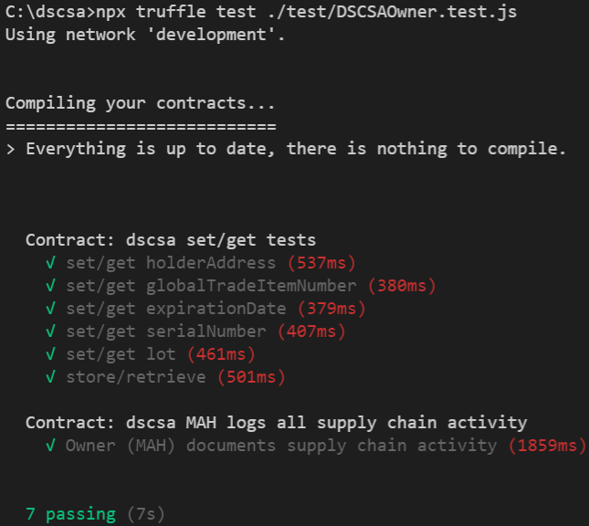

#  Drug Supply Chain Security Act (DSCSA) Blockchain

Implementation of the FDA DSCSA supply chain regulation in a Consortium Blockchain implemented on Ethereum.

## Overview

The DSCSA is a [FDA regulation](https://www.fda.gov/drugs/drug-supply-chain-security-act-dscsa/drug-supply-chain-security-act-law-and-policies) to track drug packages through the supply chain.  The FDA completed a DSCSA blockchain pilot in 2020: [FDA Blockchain Pilot Report](https://www.ibm.com/downloads/cas/9V2LRYG5).

## Installation

Reference [OpenZeppelin](https://docs.openzeppelin.com/learn/) for details in setting up the development environment. A summary is provided in the [80_Installation.md](doc/80_Installation.md).

## Usage

### Build Contract

Create Solidity code to inherit from DSCSAOwner:
'''
contract DSCSAOwner is DSCSAOwner {
    address internal  holderAddress;
    uint    internal  globalTradeItemNumber;
    uint    internal  expirationDate;
    string  internal  lot;
    uint    internal  serialNumber;
'''
### Test Contract: npx truffle test ./test/DSCSAOwner.test.js

