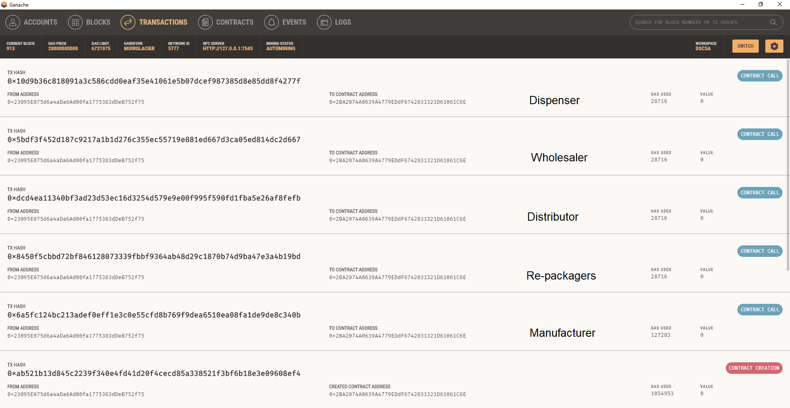

#  Drug Supply Chain Security Act (DSCSA) Blockchain

Implementation of the FDA DSCSA supply chain regulation in a Consortium Blockchain implemented on Ethereum.

## Overview

The DSCSA is a [FDA regulation](https://www.fda.gov/drugs/drug-supply-chain-security-act-dscsa/drug-supply-chain-security-act-law-and-policies) to track drug packages through the supply chain.  The FDA completed a DSCSA blockchain pilot in 2020: [FDA Blockchain Pilot Report](https://www.ibm.com/downloads/cas/9V2LRYG5).

## Installation

Reference [OpenZeppelin](https://docs.openzeppelin.com/learn/) for details in setting up the development environment. A summary is provided in the [80_Installation.md](doc/80_Installation.md).

## Usage

### Build Contract

Create Solidity code to inherit from DSCSAOwner:

```javascript
pragma solidity 0.8.4;
import "./DSCSAOwner.sol";

contract DSCSAOwnerMock is DSCSAOwner {
    // Real use case would add custom logic here
}
```

### Compile and Deploy

```javascript
npx truffle compile ./contracts/DSCSAOwnerMock.sol
npx truffle migrate --network development
```

### Test Contract

Launch Ganache for Blockchain testing and then run the test:

```javascript
npx truffle test ./test/DSCSAOwnerMock.test.js
```

#### Truffle Testing Output


#### Ganache Testing Output Labeled



The Ganache blockchain explorer shows a contract being created and the holder being changed by the MAH.
