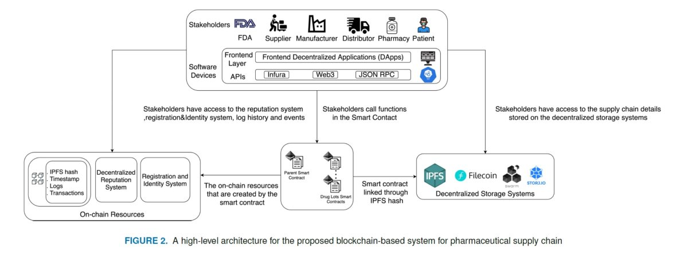
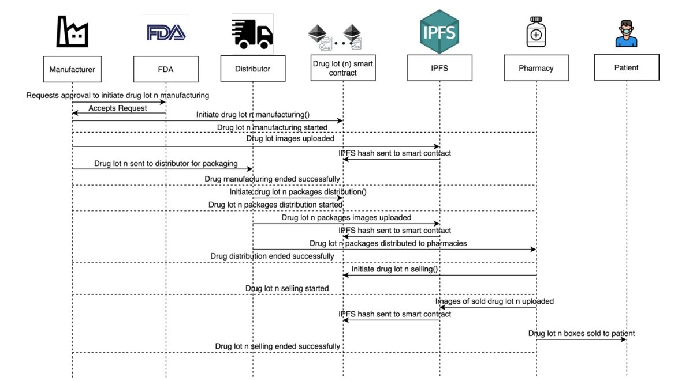

#  High level design

Based on the business scenarios, the design will strive to provide maximum flexibility on Ethereum and other blockchains.  This design will focus on the storage of application data first and then the mechanics of supply chain financial transactions.  

Design is based on leveraging [OpenZeppelin](https://docs.openzeppelin.com/contracts/4.x/) smart contracts.

- Implement the DSCSA via the [ERC1155 Multi Token Standard](https://docs.openzeppelin.com/contracts/4.x/erc1155)
- Add [AccessControl](https://docs.openzeppelin.com/contracts/4.x/api/access#AccessControl)

A similar design was presented by [Middle East Medicine](https://www.middleeastmedicalportal.com/a-blockchain-based-approach-for-drug-traceability-in-healthcare-supply-chain/):

## Initial Design

- Track the smallest sealable unit (package) identified by the Serial Number (S/N)
- Use [ERC1155 Multi Token Standard](https://docs.openzeppelin.com/contracts/4.x/erc1155)
- Use [AccessControl](https://docs.openzeppelin.com/contracts/4.x/api/access#AccessControl)
- Include composite key information (GTIN+LOT)
- Include state information (Expiration Date)
- Obfuscate additional data like Trade name into the referenced Metadata which can encrypted if desired
- Create DSCSA blockchain

## IPFS

[IPFS GitHub](https://github.com/ipfs/js-ipfs/blob/master/docs/core-api/FILES.md#ipfsadddata-options)
